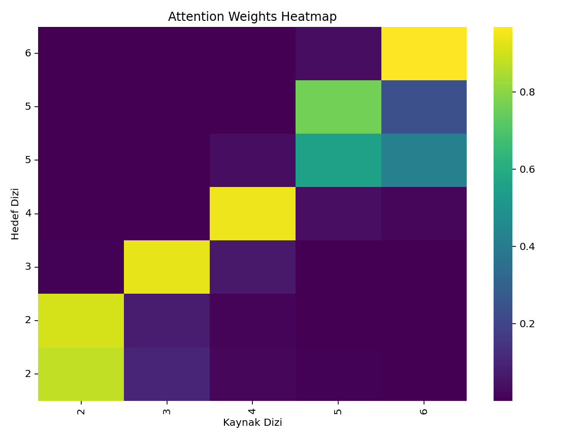
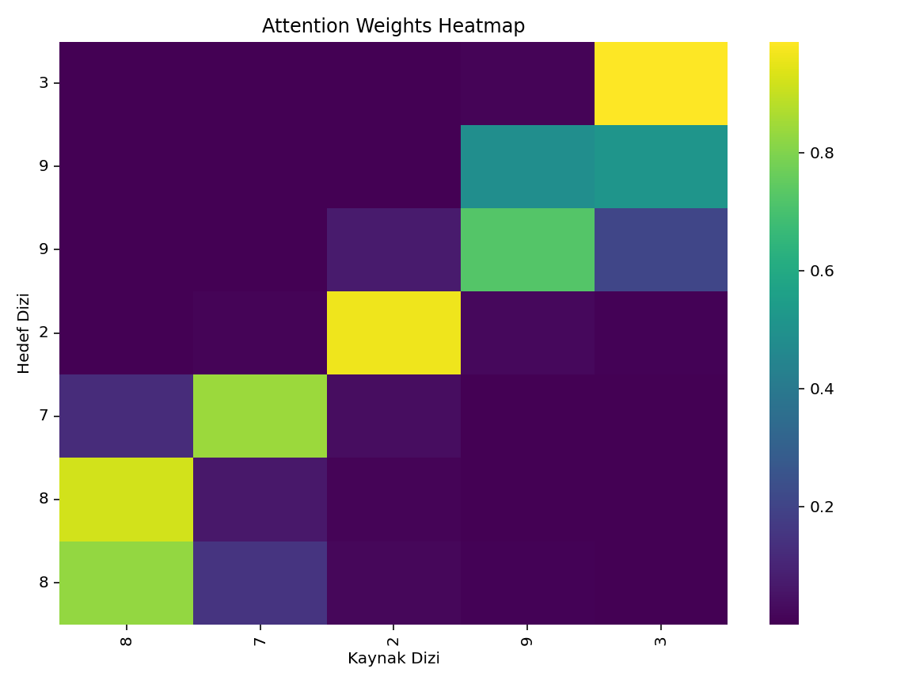
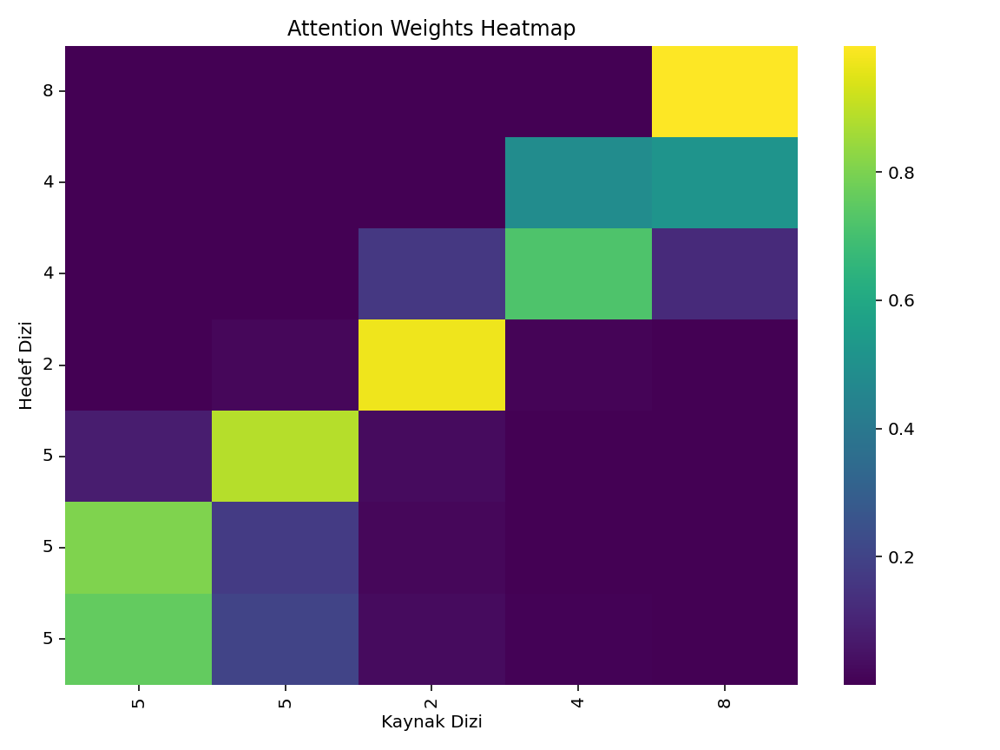
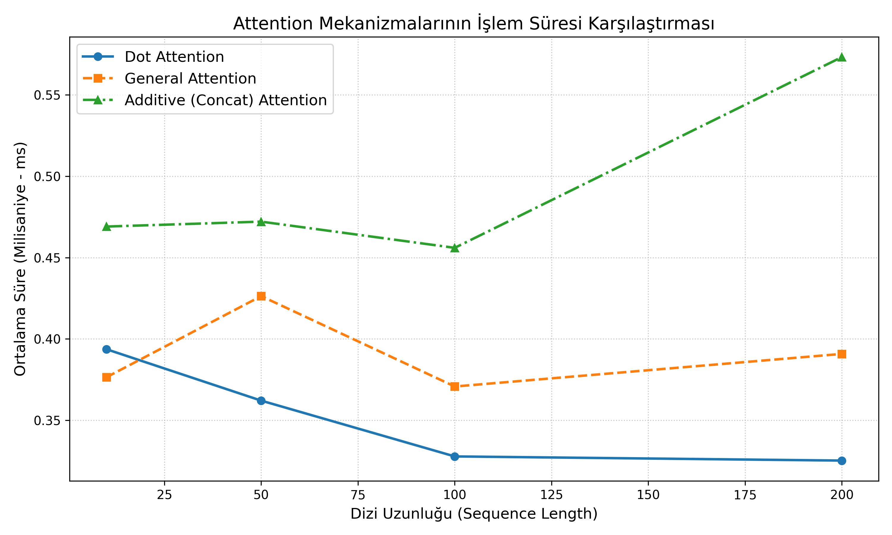

# 🔍 Seq2Seq Modellerinde Attention Mekanizmalarının İmplementasyonu ve Analizi

Bu proje, Makine Çevirisi (Machine Translation) için basit bir Seq2Seq modeli üzerinde çeşitli Attention (Dikkat) mekanizmalarının sıfırdan implementasyonunu ve performans analizlerini içermektedir.

## 📌 İçindekiler
- [Ödev 1: Attention İmplementasyonu](#ödev-1-attention-i̇mplementasyonu)
  - [Çeviri Örnekleri](#çeviri-örnekleri)
  - [Attention Heatmap Görselleştirmeleri](#attention-heatmap-görselleştirmeleri)
- [Ödev 2: Attention Analizi](#ödev-2-attention-analizi)
  - [Performans Karşılaştırması (Dot, General, Additive)](#performans-karşılaştırması)
  - [Hesaplama Süreleri (Execution Time)](#hesaplama-süreleri-execution-time)
  - [Zaman Karmaşıklığı Grafiği](#zaman-karmaşıklığı-grafiği)
  - [Sonuç ve Tartışma](#sonuç-ve-tartışma)
- [Kurulum ve Çalıştırma](#kurulum-ve-çalıştırma)

---

## 🚀 Ödev 1: Attention İmplementasyonu

Bu bölümde **Bahdanau (Additive)** ve **Luong (Multiplicative)** attention mekanizmaları sıfırdan PyTorch ile yazılmış ve basit bir Seq2Seq mimarisine entegre edilmiştir. Model, örnek bir görev olarak (dizi tersine çevirme) eğitilmiş ve Erken Durdurma (Early Stopping) ile en iyi ağırlıklar elde edilmiştir.

### Çeviri Örnekleri
Modelin test veri setindeki başarısı:
* **Test 1:** Kaynak: `2 3 4 5 6` ➡️ Hedef: `6 5 5 4 3 2 2`
* **Test 2:** Kaynak: `8 7 2 9 3` ➡️ Hedef: `3 9 9 2 7 8 8`
* **Test 3:** Kaynak: `5 5 2 4 8` ➡️ Hedef: `8 4 4 2 5 5 5`

### Attention Heatmap Görselleştirmeleri
Modelin çıktı dizisini üretirken kaynak dizinin hangi elemanlarına odaklandığını (attention weights) gösteren ısı haritaları aşağıdadır. Modelin diziyi tersine çevirme görevini başarıyla öğrendiği köşegen (diagonal) yapıdan açıkça görülmektedir.

| Test 1 | Test 2 | Test 3 |
|:---:|:---:|:---:|
|  |  |  |

---

## 📊 Ödev 2: Attention Analizi

Bu bölümde üç farklı Luong attention skoru hesaplama yöntemi CUDA üzerinde karşılaştırılmıştır:
1. **Dot:** $h_t^T \cdot \bar{h}_s$
2. **General:** $h_t^T \cdot W_a \cdot \bar{h}_s$
3. **Additive:** $v_a^T \cdot \tanh(W_a \cdot [h_t; \bar{h}_s])$

### Hesaplama Süreleri (Execution Time)
Farklı dizi uzunlukları (Sequence Length) için elde edilen ortalama ileri besleme (forward pass) süreleri:

| Dizi Uzunluğu | Dot Attention (ms) | General Attention (ms) | Additive Attention (ms) |
| :---: | :---: | :---: | :---: |
| **10** | 0.3937 | 0.3764 | 0.4691 |
| **50** | 0.3620 | 0.4263 | 0.4721 |
| **100** | 0.3277 | 0.3707 | 0.4560 |
| **200** | 0.3252 | 0.3908 | 0.5733 |

### Zaman Karmaşıklığı Grafiği
Aşağıdaki grafik, dizi uzunluğu ile attention mekanizmalarının işlem süresi maliyetleri arasındaki ilişkiyi göstermektedir.



### 💡 Sonuç ve Tartışma
Elde edilen sonuçlar ve grafik incelendiğinde şu sonuçlara varılmıştır:
* **Dot Attention:** Ekstra ağırlık matrisi olmadığı için genel olarak en hızlı çalışan yöntem olmuştur. Dizi uzunluğu arttıkça (200'e doğru) GPU optimizasyonları sayesinde matris çarpımlarının maliyetini daha iyi absorbe edebilmiştir.
* **General Attention:** Araya bir $W_a$ ağırlık matrisi aldığı için Dot yöntemine kıyasla işlem süresi bir miktar daha fazladır ancak bu sayede boyut esnekliği sağlamaktadır. Süre grafiği genel olarak orta bantta seyretmiştir.
* **Additive (Bahdanau/Concat) Attention:** Hem daha büyük boyutlu ağırlık matrisleri içerir hem de $tanh$ aktivasyon fonksiyonundan geçirilir. En karmaşık matematiksel işleme sahip olduğu için testlerde istikrarlı bir şekilde en yavaş çalışan yöntem olmuştur. Özellikle 200 dizi uzunluğunda süre artışı belirginleşmiştir.

---

## ⚙️ Kurulum ve Çalıştırma

Projeyi lokalinizde çalıştırmak için:

```bash
git clone [https://github.com/RamazanKaratut/Seq2Seq-Attention-Analysis.git](https://github.com/RamazanKaratut/Seq2Seq-Attention-Analysis.git)
cd Seq2Seq-Attention-Analysis
pip install -r requirements.txt
python main.py
python analysis.py